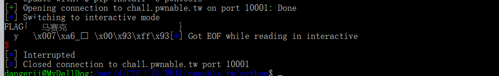

## **Wp for orw**
+ IDA查看反汇编代码，发现程序直接执行以二进制字符输入的程序，并由题目提示知，只能使用open，read，write的系统调用函数，所以编写如下汇编代码。
+ 
+ 其中push指令将已知flag地址压入堆栈，并将esp传入ebx作为系统调用open的参数。使用read从已打开文件3中读取内容到esp指向处，write从esp处输出到标准输出。
+ 使用pwntools中asm模块，将该代码转为二进制字符串作为payload上传。即可获得flag。结果如下。
+ 代码
+ + 
+ 结果
+ + 

+ [wp_orw_doc](./wp_orw.docx)
### 返回
+ [README.md](../README.md)
